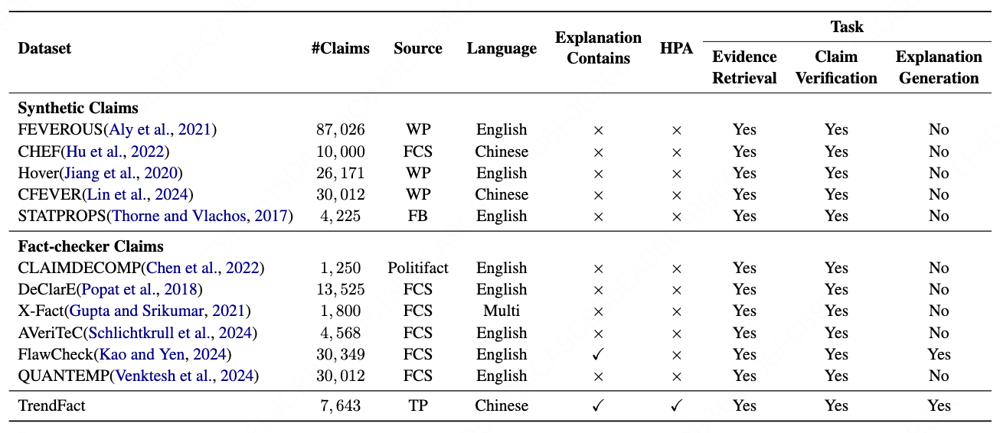
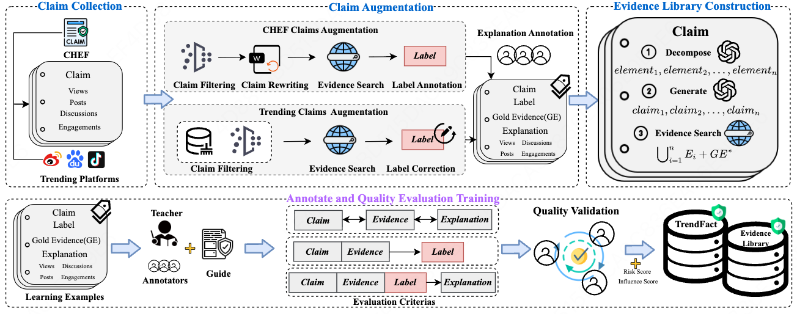
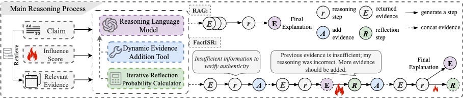

<h1 align="center">TrendFact: A Benchmark Towards Hotspot Perception in Automatic Fact-Checking</h1>

<p align="center">
  <a href="https://aclanthology.org/2026.acl-long.1219/"></a>
  <a href="https://huggingface.co/datasets/zxc123cc/TrendFact"></a>
  <a href="./LICENSE"></a>
</p>


## Overview
<p align="center">
  
</p>

<p align="center">
  
</p>

## FactISR

<p align="center">
  
</p>

## Metrics

We release the implementation of our two proposed metrics, ECS and HCPI, under `metrics/`.

### ECS (Explanation Consistency Score)

ECS uses an LLM as a judge to score how consistent a generated explanation is with the gold one. Set your API credentials via environment variables first:

```bash
export OPENAI_API_KEY=your_key
export OPENAI_API_BASE=https://api.openai.com/v1   # optional
export OPENAI_MODEL=gpt-4o-2024-11-20              # optional
```

```bash
python metrics/cal_ECS.py --input_file results.json --output_file results_ECS.json
```

The input file is a JSON list where each sample contains at least `claim`, `explanation` (gold) and the model output (`llm_response`, or `llm_response_parse` / `llm_think` + `llm_response`).

### HCPI (Hotspot Claim Perception Index)

HCPI fuses the influence score with ECS to measure hotspot perception ability. It reads the ECS output above:

```bash
python metrics/cal_HCPI.py --input_file results_ECS.json
```

## Citation
```bibtex
@inproceedings{zhang2026trendfact,
  title={TrendFact: A Benchmark Towards Hotspot Perception in Automatic Fact-Checking},
  author={Zhang, Xiaocheng and Wang, Xi and Lu, Yifei and Wang, Jianing and Ye, Zhuangzhuang and Bao, Mengjiao and Yan, Peng and Su, Xiaohong},
  booktitle={Proceedings of the 64th Annual Meeting of the Association for Computational Linguistics (Volume 1: Long Papers)},
  pages={26494--26513},
  year={2026}
}
```

